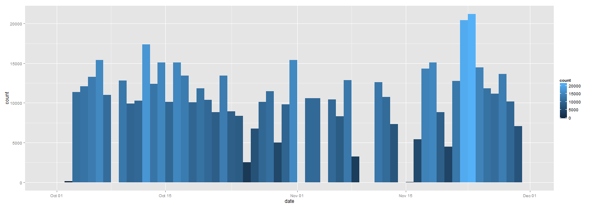
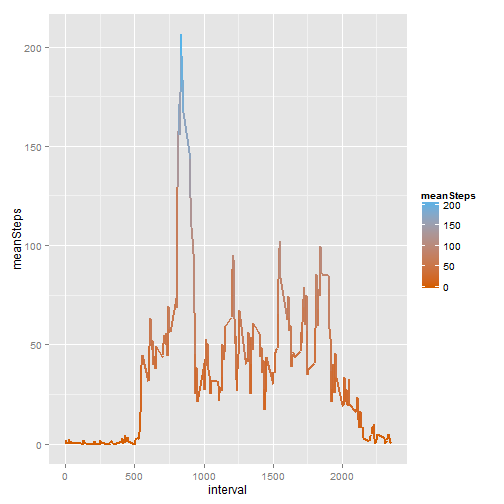
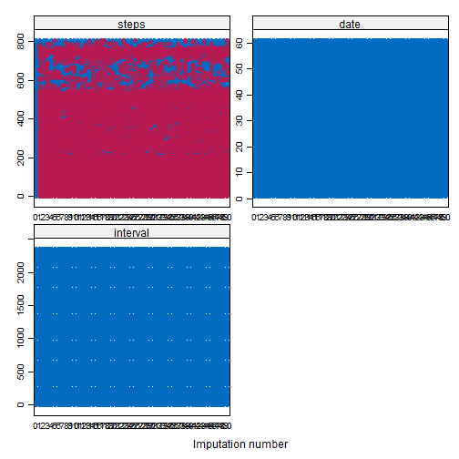
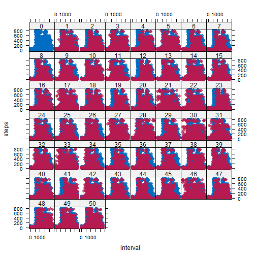
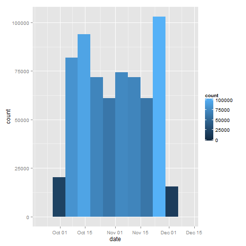
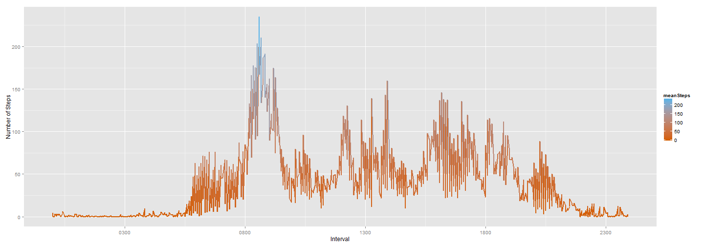
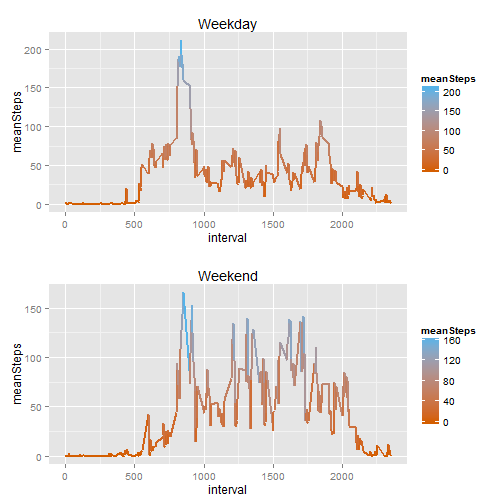

# Reproducible Research: Peer Assessment 1

```r
library(lattice)
library(ggplot2)
library(mice)
library(plyr)
library(knitr)
library(grid)
library(gridExtra)
```

## Loading and preprocessing the data

```r
data <- read.csv("activity/activity.csv")
data[, "date"] <- as.Date(data$date)
```

## Count NA

```r
sum(is.na(data))
```

```
## [1] 2304
```

## What is mean total number of steps taken per day?

```r
totalStepsPerDay <- ddply(data, .(date), summarize, Total = sum(steps, na.rm = TRUE))
```


## Create Histogram
## Determine Number of Bins

```r
class = nclass.Sturges(totalStepsPerDay$Total)
```

## Calculate bin width

```r
bin = range(totalStepsPerDay$Total)/class
```

## Plot Histogram 

```r
ggplot(totalStepsPerDay, aes(x = Total)) + geom_histogram(aes(fill = ..count..), 
    binwidth = bin[2])
```

 


## What is mean total number of steps taken per day?
## mean

```r
mean(totalStepsPerDay$Total)
```

```
## [1] 9354
```

## median

```r
median(totalStepsPerDay$Total)
```

```
## [1] 10395
```


## What is the average daily activity pattern?

```r
averageStepsPerinterval <- ddply(data, .(interval), summarize, meanSteps = mean(steps, 
    na.rm = TRUE))
```

## max mean Steps interval

```r
averageStepsPerinterval[which.max(averageStepsPerinterval$meanSteps), ]
```

```
##     interval meanSteps
## 104      835     206.2
```

## Plot Mean Steps vs interval

```r
ggplot(averageStepsPerinterval, aes(x = interval, y = meanSteps)) + geom_line(aes(colour = meanSteps), 
    size = 1) + scale_colour_gradient(high = "#56B4E9", low = "#D55E00")
```

 


## Imputing missing values
Data was imputed with multiple imputation using the mice package. The method used was predictive mean matching. An extra column was added where the date column is converted to a factor and then a numeric. I did this to make imputing with mice package work. Results seem reasonable. However, more diagnostics should probably be done. Extra iterations should also probably be done to decrese the noise.  Only 5 iterations were run.

```r
timeData = data.frame(data, time = as.numeric(factor(data$date)))
miceData = data.frame(steps = timeData$steps, date = timeData$time, interval = timeData$interval)
```


```r
imp <- imp <- mice(miceData, m = 5, seed = 23109)
```

```
## 
##  iter imp variable
##   1   1  steps
##   1   2  steps
##   1   3  steps
##   1   4  steps
##   1   5  steps
##   2   1  steps
##   2   2  steps
##   2   3  steps
##   2   4  steps
##   2   5  steps
##   3   1  steps
##   3   2  steps
##   3   3  steps
##   3   4  steps
##   3   5  steps
##   4   1  steps
##   4   2  steps
##   4   3  steps
##   4   4  steps
##   4   5  steps
##   5   1  steps
##   5   2  steps
##   5   3  steps
##   5   4  steps
##   5   5  steps
```


```r
stripplot(imp, pch = 20, cex = 1.2)
```

 


```r
xyplot(imp, steps ~ interval | .imp, pch = 20, cex = 1.4)
```

 


```r
imputedData = complete(imp)
recombinedData = data.frame(steps = imputedData$steps, date = data$date, interval = imputedData$interval)
```

## What is mean total number of steps taken per day?

```r
imputedTotalStepsPerDay <- ddply(recombinedData, .(date), summarize, Total = sum(steps))
```


## Create Histogram
## Determine Number of Bins

```r
class = nclass.Sturges(imputedTotalStepsPerDay$Total)
```

## Calculate bin width

```r
bin = range(imputedTotalStepsPerDay$Total)/class
```

## Plot Histogram 

```r
ggplot(imputedTotalStepsPerDay, aes(x = Total)) + geom_histogram(aes(fill = ..count..), 
    binwidth = bin[2])
```

 


## What is mean total number of steps taken per day?
## Mean

```r
mean(imputedTotalStepsPerDay$Total)
```

```
## [1] 10783
```

## Median

```r
median(imputedTotalStepsPerDay$Total)
```

```
## [1] 10765
```

## Are there differences in activity patterns between weekdays and weekends?

```r
recombinedData <- transform(recombinedData, week = ifelse(weekdays(data$date) %in% 
    c("Sunday", "Saturday"), "Weekend", "Weekday"))
```


```r
newaverageStepsPerinterval <- ddply(recombinedData, .(interval, week), summarize, 
    meanSteps = mean(steps))
```


```r
ggplot(newaverageStepsPerinterval, aes(x = interval, y = meanSteps)) + geom_line(aes(colour = meanSteps), 
    size = 1) + scale_colour_gradient(high = "#56B4E9", low = "#D55E00")
```

 


```r
weekday = ggplot(newaverageStepsPerinterval, aes(x = interval, y = meanSteps)) + 
    geom_line(aes(colour = meanSteps), size = 1, subset = .(week == "Weekday")) + 
    scale_colour_gradient(high = "#56B4E9", low = "#D55E00") + ggtitle("Weekday")
```


```r
weekend = ggplot(newaverageStepsPerinterval, aes(x = interval, y = meanSteps)) + 
    geom_line(aes(colour = meanSteps), size = 1, subset = .(week == "Weekend")) + 
    scale_colour_gradient(high = "#56B4E9", low = "#D55E00") + ggtitle("Weekend")
```


```r
grid.arrange(weekday, weekend, ncol = 1)
```

 

