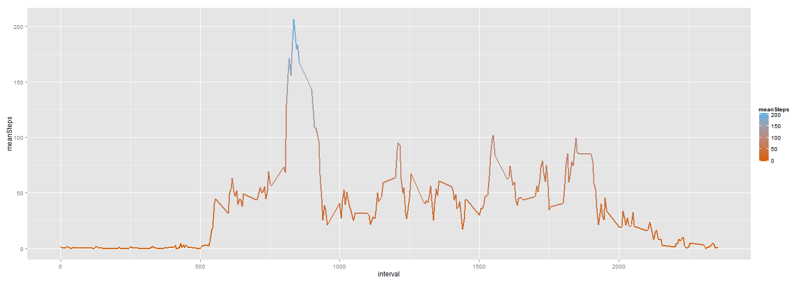
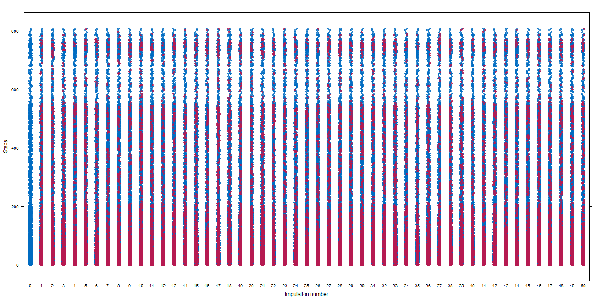
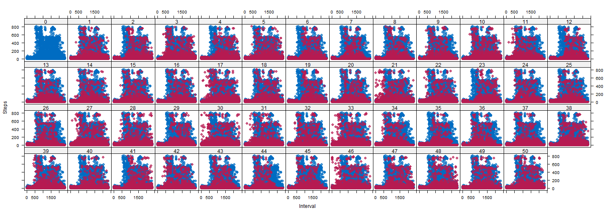

# Reproducible Research: Peer Assessment 1

```r
library(lattice)
library(ggplot2)
library(mice)
```

```
## Loading required package: Rcpp
## mice 2.21 2014-02-05
```

```r
library(plyr)
library(knitr)
library(grid)
library(gridExtra)
```

## Loading and preprocessing the data

```r
data <- read.csv("activity/activity.csv")
data[, "date"] <- as.Date(data$date)
```

#### Count NA Values

```r
sum(is.na(data))
```

```
## [1] 2304
```

## What is mean total number of steps taken per day?
### Create Histogram

#### Total steps per day was calculated using ddply.

```r
totalStepsPerDay <- ddply(data, .(date), summarize, Total = sum(steps, na.rm = TRUE))
```


#### Plot Histogram 

```r
ggplot(totalStepsPerDay, aes(x = date)) + geom_histogram(aes(fill = ..count.., 
    weight = Total), binwidth = 1)
```

 


#### Mean

```r
mean(totalStepsPerDay$Total)
```

```
## [1] 9354
```

#### Median

```r
median(totalStepsPerDay$Total)
```

```
## [1] 10395
```


## What is the average daily activity pattern?

#### Average steps in an interval was first calculated with ddply.

```r
averageStepsPerinterval <- ddply(data, .(interval), summarize, meanSteps = mean(steps, 
    na.rm = TRUE))
```

#### Max Mean Steps in an Interval

```r
averageStepsPerinterval[which.max(averageStepsPerinterval$meanSteps), ]
```

```
##     interval meanSteps
## 104      835     206.2
```

#### Plot Mean Steps vs Interval

```r
ggplot(averageStepsPerinterval, aes(x = interval, y = meanSteps)) + geom_line(aes(colour = meanSteps), 
    size = 1) + scale_colour_gradient(high = "#56B4E9", low = "#D55E00")
```

 


## Imputing missing values

Data was imputed with multiple imputation using the mice package. The method used was predictive mean matching. An extra column was added where the date column is converted to a factor and then a numeric. I did this to make imputing with mice package work. Results seem reasonable. However, more diagnostics should probably be done. Extra iterations should also probably be done to decrese the noise. Convergence should also be checked. It was difficult finding a suitable technique for zero inflated count data. 50 imputaions were run with 5 iterations.

#### Create New Factor Variable.

```r
timeData = data.frame(data, time = as.numeric(factor(data$date)))
miceData = data.frame(steps = timeData$steps, date = timeData$time, interval = timeData$interval)
head(miceData)
```

```
##   steps date interval
## 1    NA    1        0
## 2    NA    1        5
## 3    NA    1       10
## 4    NA    1       15
## 5    NA    1       20
## 6    NA    1       25
```

#### Run the Imputation

```r
imp <- imp <- mice(miceData, m = 50, seed = 23109)
```

```
## 
##  iter imp variable
##   1   1  steps
##   1   2  steps
##   1   3  steps
##   1   4  steps
##   1   5  steps
##   1   6  steps
##   1   7  steps
##   1   8  steps
##   1   9  steps
##   1   10  steps
##   1   11  steps
##   1   12  steps
##   1   13  steps
##   1   14  steps
##   1   15  steps
##   1   16  steps
##   1   17  steps
##   1   18  steps
##   1   19  steps
##   1   20  steps
##   1   21  steps
##   1   22  steps
##   1   23  steps
##   1   24  steps
##   1   25  steps
##   1   26  steps
##   1   27  steps
##   1   28  steps
##   1   29  steps
##   1   30  steps
##   1   31  steps
##   1   32  steps
##   1   33  steps
##   1   34  steps
##   1   35  steps
##   1   36  steps
##   1   37  steps
##   1   38  steps
##   1   39  steps
##   1   40  steps
##   1   41  steps
##   1   42  steps
##   1   43  steps
##   1   44  steps
##   1   45  steps
##   1   46  steps
##   1   47  steps
##   1   48  steps
##   1   49  steps
##   1   50  steps
##   2   1  steps
##   2   2  steps
##   2   3  steps
##   2   4  steps
##   2   5  steps
##   2   6  steps
##   2   7  steps
##   2   8  steps
##   2   9  steps
##   2   10  steps
##   2   11  steps
##   2   12  steps
##   2   13  steps
##   2   14  steps
##   2   15  steps
##   2   16  steps
##   2   17  steps
##   2   18  steps
##   2   19  steps
##   2   20  steps
##   2   21  steps
##   2   22  steps
##   2   23  steps
##   2   24  steps
##   2   25  steps
##   2   26  steps
##   2   27  steps
##   2   28  steps
##   2   29  steps
##   2   30  steps
##   2   31  steps
##   2   32  steps
##   2   33  steps
##   2   34  steps
##   2   35  steps
##   2   36  steps
##   2   37  steps
##   2   38  steps
##   2   39  steps
##   2   40  steps
##   2   41  steps
##   2   42  steps
##   2   43  steps
##   2   44  steps
##   2   45  steps
##   2   46  steps
##   2   47  steps
##   2   48  steps
##   2   49  steps
##   2   50  steps
##   3   1  steps
##   3   2  steps
##   3   3  steps
##   3   4  steps
##   3   5  steps
##   3   6  steps
##   3   7  steps
##   3   8  steps
##   3   9  steps
##   3   10  steps
##   3   11  steps
##   3   12  steps
##   3   13  steps
##   3   14  steps
##   3   15  steps
##   3   16  steps
##   3   17  steps
##   3   18  steps
##   3   19  steps
##   3   20  steps
##   3   21  steps
##   3   22  steps
##   3   23  steps
##   3   24  steps
##   3   25  steps
##   3   26  steps
##   3   27  steps
##   3   28  steps
##   3   29  steps
##   3   30  steps
##   3   31  steps
##   3   32  steps
##   3   33  steps
##   3   34  steps
##   3   35  steps
##   3   36  steps
##   3   37  steps
##   3   38  steps
##   3   39  steps
##   3   40  steps
##   3   41  steps
##   3   42  steps
##   3   43  steps
##   3   44  steps
##   3   45  steps
##   3   46  steps
##   3   47  steps
##   3   48  steps
##   3   49  steps
##   3   50  steps
##   4   1  steps
##   4   2  steps
##   4   3  steps
##   4   4  steps
##   4   5  steps
##   4   6  steps
##   4   7  steps
##   4   8  steps
##   4   9  steps
##   4   10  steps
##   4   11  steps
##   4   12  steps
##   4   13  steps
##   4   14  steps
##   4   15  steps
##   4   16  steps
##   4   17  steps
##   4   18  steps
##   4   19  steps
##   4   20  steps
##   4   21  steps
##   4   22  steps
##   4   23  steps
##   4   24  steps
##   4   25  steps
##   4   26  steps
##   4   27  steps
##   4   28  steps
##   4   29  steps
##   4   30  steps
##   4   31  steps
##   4   32  steps
##   4   33  steps
##   4   34  steps
##   4   35  steps
##   4   36  steps
##   4   37  steps
##   4   38  steps
##   4   39  steps
##   4   40  steps
##   4   41  steps
##   4   42  steps
##   4   43  steps
##   4   44  steps
##   4   45  steps
##   4   46  steps
##   4   47  steps
##   4   48  steps
##   4   49  steps
##   4   50  steps
##   5   1  steps
##   5   2  steps
##   5   3  steps
##   5   4  steps
##   5   5  steps
##   5   6  steps
##   5   7  steps
##   5   8  steps
##   5   9  steps
##   5   10  steps
##   5   11  steps
##   5   12  steps
##   5   13  steps
##   5   14  steps
##   5   15  steps
##   5   16  steps
##   5   17  steps
##   5   18  steps
##   5   19  steps
##   5   20  steps
##   5   21  steps
##   5   22  steps
##   5   23  steps
##   5   24  steps
##   5   25  steps
##   5   26  steps
##   5   27  steps
##   5   28  steps
##   5   29  steps
##   5   30  steps
##   5   31  steps
##   5   32  steps
##   5   33  steps
##   5   34  steps
##   5   35  steps
##   5   36  steps
##   5   37  steps
##   5   38  steps
##   5   39  steps
##   5   40  steps
##   5   41  steps
##   5   42  steps
##   5   43  steps
##   5   44  steps
##   5   45  steps
##   5   46  steps
##   5   47  steps
##   5   48  steps
##   5   49  steps
##   5   50  steps
```


Here is a summary of the imputation.

```r
imp
```

```
## Multiply imputed data set
## Call:
## mice(data = miceData, m = 50, seed = 23109)
## Number of multiple imputations:  50
## Missing cells per column:
##    steps     date interval 
##     2304        0        0 
## Imputation methods:
##    steps     date interval 
##    "pmm"       ""       "" 
## VisitSequence:
## steps 
##     1 
## PredictorMatrix:
##          steps date interval
## steps        0    1        1
## date         0    0        0
## interval     0    0        0
## Random generator seed value:  23109
```


Data with with missing values is in blue. Red is imputed data. 

We can see how our imputed data clusters with our observed data with each iteration. So far it looks fairly decent.


```r
stripplot(imp, steps, pch = 20, cex = 1.2)
```

 

The other plots of the other variables are strictly blue since we did not impute any data into them.  Here is a plot of them for comparison.

```r
stripplot(imp, interval + date ~ .imp, pch = 20, cex = 1.2)
```

 

Next is a plot of the of steps vs interval with each iteration of the imputaion. We can see our imputed data evelve throughout the algorithm and observe that the distribution doesn't stray too far from the observed data.


```r
xyplot(imp, steps ~ interval | .imp, pch = 20, cex = 1.4)
```

 

Checking convergence of the mice algorithm can be done with the following plots of our imputed data. Since there is very little trend in any of the plots we assume convergence.

```r
plot(imp, c("steps"), layout = c(2, 1))
```

 

Here we just extract our imputed data frame and add back in our original date column.

```r
imputedData = complete(imp)
recombinedData = data.frame(steps = imputedData$steps, date = data$date, interval = imputedData$interval)
head(recombinedData)
```

```
##   steps       date interval
## 1     0 2012-10-01        0
## 2     0 2012-10-01        5
## 3     0 2012-10-01       10
## 4     0 2012-10-01       15
## 5     0 2012-10-01       20
## 6    47 2012-10-01       25
```

## What is mean total number of steps taken per day?
The imputed data changes both the mean and meadian. It actually increases them. This is probably due to the data not being dominated by zero values as much with the addition of the imputed data. We can notice a difference in the histogram and the time series plot.

### Create Histogram

#### Calculate Total Steps per Day.

```r
imputedTotalStepsPerDay <- ddply(recombinedData, .(date), summarize, Total = sum(steps))
```


#### Plot Histogram 

```r
ggplot(imputedTotalStepsPerDay, aes(x = date)) + geom_histogram(aes(fill = ..count.., 
    weight = Total), binwidth = 1)
```

 


#### Mean

```r
mean(imputedTotalStepsPerDay$Total)
```

```
## [1] 10730
```

#### Median

```r
median(imputedTotalStepsPerDay$Total)
```

```
## [1] 10600
```

## Are there differences in activity patterns between weekdays and weekends?

#### Add New Weekened/Weekday Factor
A Weekend and Weekday factor was added to the new data frame.

```r
recombinedData <- transform(recombinedData, week = ifelse(weekdays(data$date) %in% 
    c("Sunday", "Saturday"), "Weekend", "Weekday"))
```


#### Mean Steps in an Interval with Imputed Data

```r
newaverageStepsPerinterval <- ddply(recombinedData, .(interval, week), summarize, 
    meanSteps = mean(steps))
```


```r
ggplot(newaverageStepsPerinterval, aes(x = interval, y = meanSteps)) + geom_line(aes(colour = meanSteps), 
    size = 1) + scale_colour_gradient(high = "#56B4E9", low = "#D55E00")
```

 

#### Comparing Weekend and Weeday Patterns with Imputed Data

Using the following plots we can see a slight difference in patterns between weekday and weekends.

```r
weekday = ggplot(newaverageStepsPerinterval, aes(x = interval, y = meanSteps)) + 
    geom_line(aes(colour = meanSteps), size = 1, subset = .(week == "Weekday")) + 
    scale_colour_gradient(high = "#56B4E9", low = "#D55E00") + ggtitle("Weekday")
```


```r
weekend = ggplot(newaverageStepsPerinterval, aes(x = interval, y = meanSteps)) + 
    geom_line(aes(colour = meanSteps), size = 1, subset = .(week == "Weekend")) + 
    scale_colour_gradient(high = "#56B4E9", low = "#D55E00") + ggtitle("Weekend")
```


```r
grid.arrange(weekday, weekend, ncol = 1)
```

 

